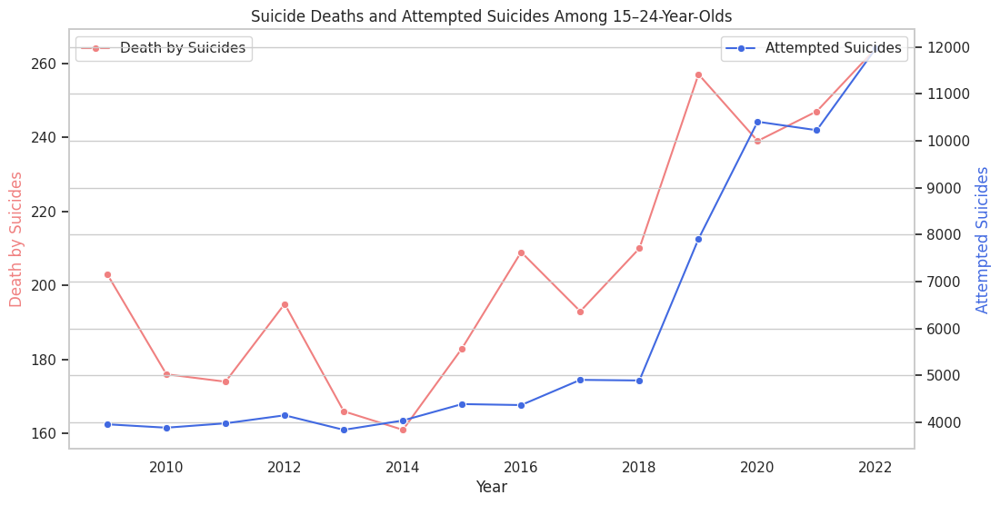
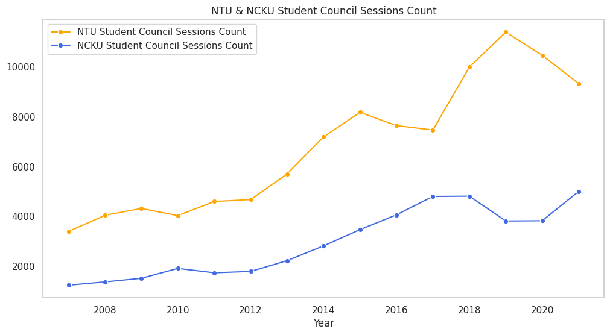
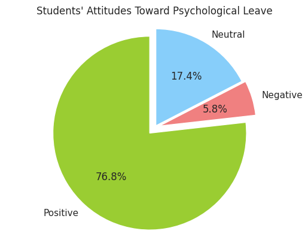
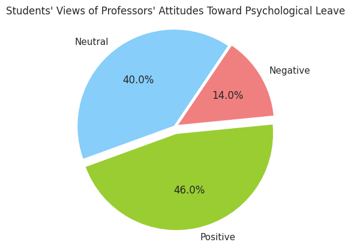

# What are the possible futures for Mental Health Support Systems within Higher Education?
A responsive and interactive website designed to raise awareness about mental health issues among university students.<br>
Built using HTML, CSS, and JavaScript, this project presents research findings, resources, and interactive storytelling<br> 
to raise awareness of mental well-being within Taiwan University campuses.<br><br>
<b>Note</b>: Content is in Chinese; project demonstrates front-end development and interactive data visualization<br>
For English readers please refer to the English Summary Section Below
## 📂 Project Structure
```text
.
├── index.html        # Main homepage
├── css/           # CSS files for styling
│   └── style.css
├── java/          # JavaScript functionality
│   └── file.js
└── img/           # Images
│
└── vid/           # Videos
```
## 🚀 How to Run Locally
Clone the repository<br>
Recommended: Read the website with PC on Google Chrome for the best experience
   ```bash
   git clone https://leonhsuportfolio.github.io/EduMentalHealth.io/
```
## English Summary
### Key Insights
From 2009 to 2022, suicide rates among 15 ~ 24 year-olds fluctuated but increased overall, from 161 in 2014 to 264 in 2022, a 160% rise. On the other hand, from Suicidal Attempt reports we can see a sharp increment since 2018, and tripling since 2004. Over the same period, antidepressant drug usages under the age of 30 also nearly doubled. <br><br>
<br>

Over the same period, antidepressant drug usages under the age of 30 also nearly doubled.<br><br>
<br>

Student counseling sessions at NTU rose from 3,400 to over 11,000 annually, while NCKU experienced a 400% increase over 15 years, highlighting increased demand and strain on campus mental health services.<br><br>
<br>

Taiwan’s policy equates to 1 mental health counselor per 1,200 students, which is far below international standards (e.g., 1:477 in the U.S., 1:270 in the U.K.).<br>

These patterns suggest a widening mental health crisis among young people in Taiwan. While antidepressant use and campus counseling demand have surged, suicide rates and attempts have nonetheless continued to climb. This mismatch points to a gap between treatment access and treatment effectiveness, as well as the growing burden placed on university counseling systems. The stark counselor-to-student ratio in Taiwan—far below international standards, underscores the urgent need for stronger policy support, expanded resources, and more comprehensive approaches to youth mental health.

### On-the-Ground Challenges of Campus Counselors
Counselors manage complex student cases, administrative duties, and counseling interchangeably, leading to significant cognitive load and burnout. Take NTU as an example, during the past 5 years, 3751 more students seek help from the Student Counciling Center, however the center only hired 18 more counselors, leading to an average one-month waiting time. Additionally, compensation is capped: NTU offers NT$38,770 for bachelor’s-level staff and NT$43,630 for master’s-level counselors, both of which fall below Taiwan’s average salary. As a result, many counselors are forced to take on side jobs in order to sustain their livelihoods <br>

### Gaps & Student Perspectives
1. Misaligned expectations persist: Students hoped for “problem-solving therapists,” but counselors function more as emotional coaches rather than fixers.<br>
2. Counseling spaces feel cramped, sterile, and uncomfortable, which affects student willingness to seek support.<br>
3. We conducted a survey (n=86) that revealed: <br>
   
   
   
   --Students value psychological leaves highly themselves (76.8% positive), but they see professors as slightly less supportive (46% positive).<br>
   --This gap suggests a perceived misalignment: students strongly support mental health leave, but fewer feel professors share that level of positivity.<br>
   --Neutral responses are higher for professors’ attitudes (40% vs 17.4%), which may indicate uncertainty about institutional or faculty support<br><br>
   Note: Psychological leaves allow students to take up to 3 classes off per semester for mental health<br>

### Conclusion
Many students support the adoption of “psychological leave”. Yet, awareness is low, and stigma (e.g., labeling, teacher attitudes) remains a barrier. Therefore, we proposed 4 suggestions for improvement.<br>
1. Introduce emotional education courses to reduce counseling pressure
2. Strengthen counselor visibility and clarity around psychological leave policies
3. Provide pre-counseling materials to help students articulate their thoughts and expectations
4. Foster a campus culture where mental well-being is understood, de-stigmatized, and supported institutionally. 


